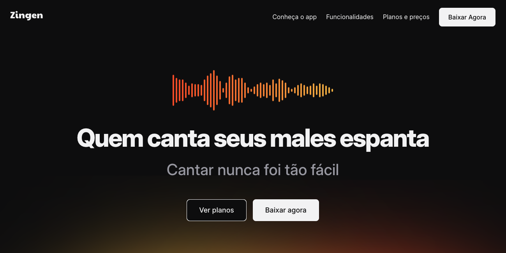

# 🎤 Zingen – Landing Page para Aplicativo de Karaokê

  Uma experiência imersiva em design responsivo e acessível para um app de karaokê que dá voz a todos.  

  <a href="#tecnologias">Tecnologias</a>&nbsp;&nbsp;|&nbsp;&nbsp;
  <a href="#sobre-o-projeto">Sobre o Projeto</a>&nbsp;&nbsp;|&nbsp;&nbsp;
  <a href="#principais-aprendizados">Aprendizados</a>&nbsp;&nbsp;|&nbsp;&nbsp;
  <a href="#licença">Licença</a>

## Tecnologias

Esse projeto foi desenvolvido com as seguintes ferramentas:

- ✅ **HTML5** – estrutura semântica e acessível  
- 🎨 **CSS3** – com foco total em responsividade e boas práticas  
- ✏️ **Figma** – para replicar fielmente o layout  
- 📱 **ResponsivelyApp** – testes em múltiplas resoluções  
- 🛠️ **Visual Studio Code** – como editor principal

---

## Sobre o Projeto

O **Zingen** é uma landing page moderna, construída do zero para apresentar um aplicativo de karaokê de maneira clara, atrativa e funcional.

Ela é composta por seções bem definidas:

- 🎯 Hero Section impactante  
- 💡 Funcionalidades do app  
- 💰 Planos e Preços  
- 📲 Área de Download

Tudo com foco em **experiência do usuário**, **acessibilidade** e **responsividade** — para que cante em qualquer dispositivo! 🎶

🔗 **Acesse o projeto online:**  
[https://delquiare.github.io/Zingen/](https://delquiare.github.io/Zingen/)

---

## Principais Aprendizados

### 🖥️ Responsividade Avançada

- Uso de **media queries** e abordagem **mobile-first**
- Testes simultâneos com o **ResponsivelyApp**
- Exibição condicional de elementos entre desktop e mobile

### 📐 Layouts Complexos

- Combinação de **CSS Grid** e **Flexbox**
- Centralização inteligente com `margin-inline: auto`
- Organização visual com espaçamentos coesos

### ♿ Acessibilidade

- Uso de **ARIA labels** para leitores de tela
- Navegação por teclado com foco visível
- Estrutura semântica com tags corretas (`<main>`, `<section>`, etc.)
- Contrastes bem trabalhados

### 🎨 Técnicas CSS Avançadas

- Uso de **variáveis CSS** (`--fs-price`, `--py-xl`, etc.)
- Seletores como `:nth-child()` para customizações
- Espaçamento fluido e responsivo

---

## Licença

Esse projeto está sob a licença **MIT**.

Feito com 💻, café ☕ e muita dedicação durante minha jornada de aprendizado em front-end.

---

